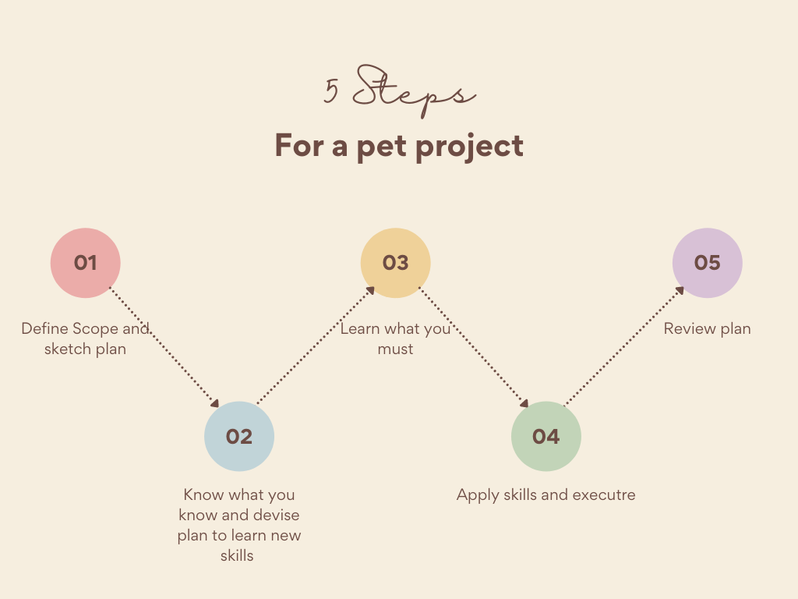
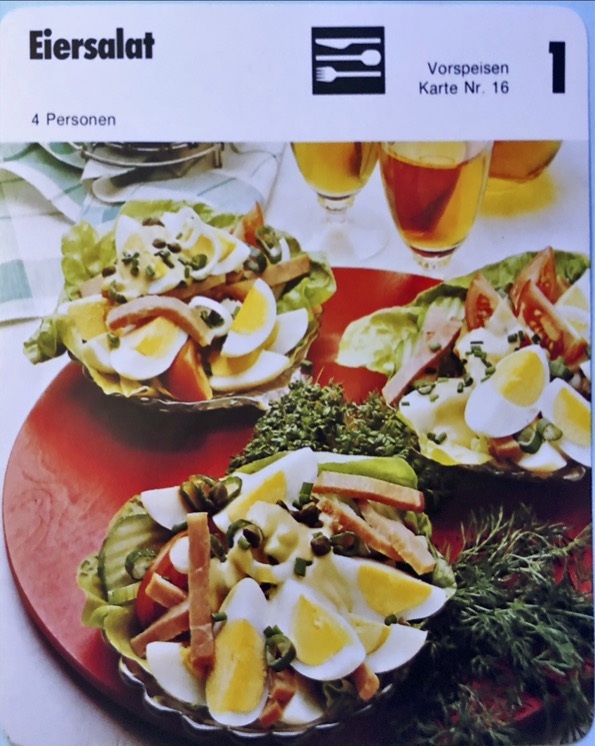
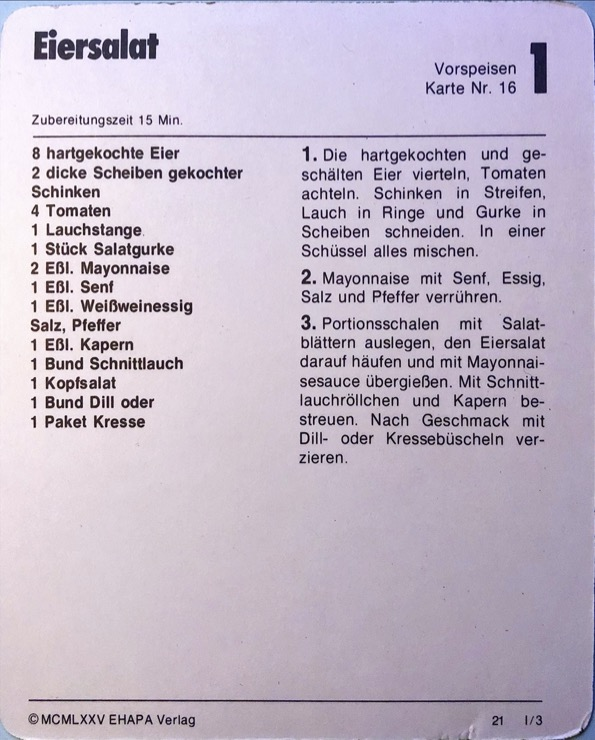

# Overview
Overview and process of extracting recipes from 1970's paper cards.
There are roughly 750 cards. I bought it in a big red box. One of the example cards is the recipe for 'Eiersalat' or Egg Salade. 

In this repo, I want to archive the process and lessons learned. During the process, I want to build a PoC here with GitHub Pages. 

# Pet Projects
This excersize is also a way for me to develop a system to coach and initiate pet projects. I've tried to capture the process in the illustration below. 

# Outcome
Website (11ty) with mined information. With the cards translated in English, Dutch, and the original German. Later I want to explore the options of searching by ingredients and using filters.

